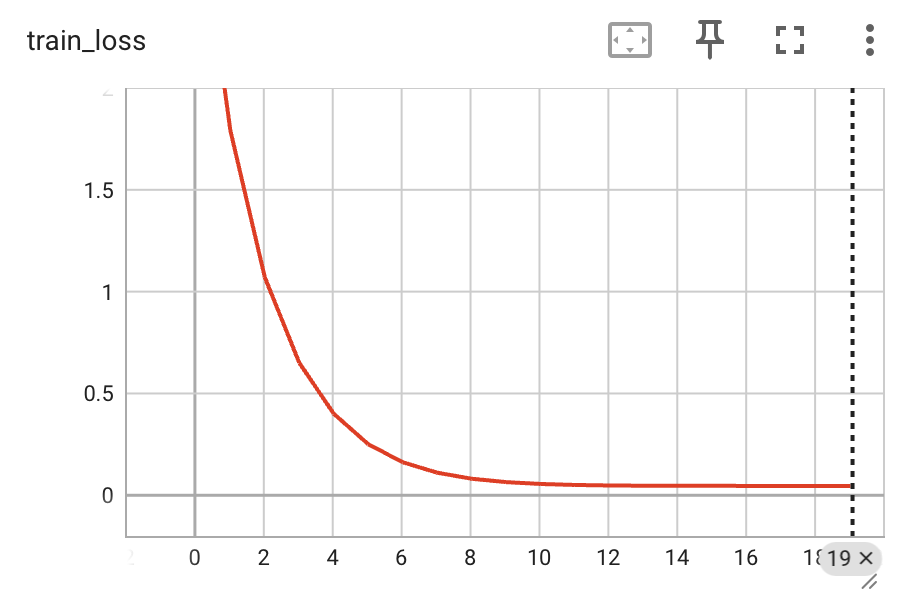
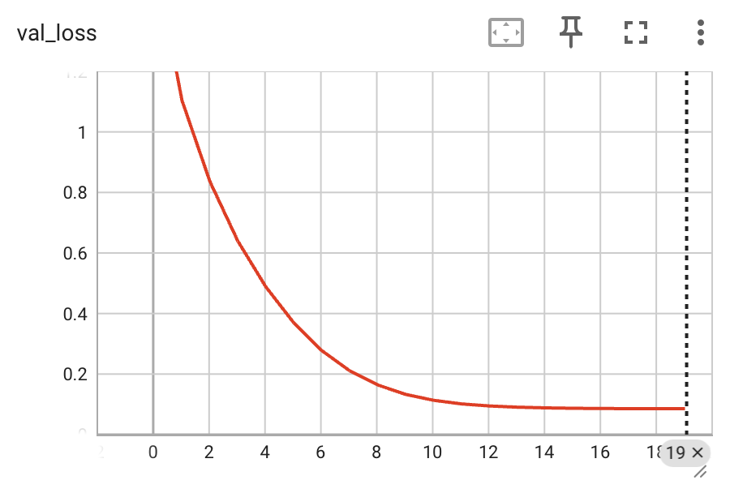
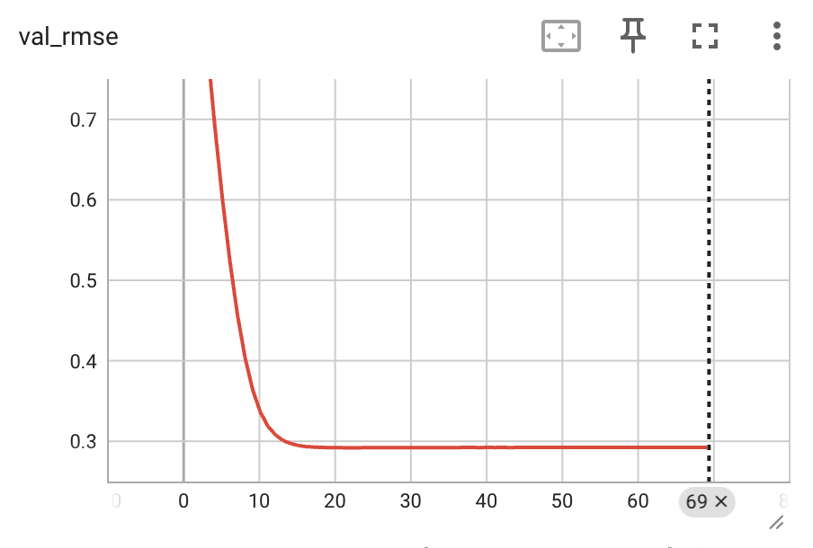
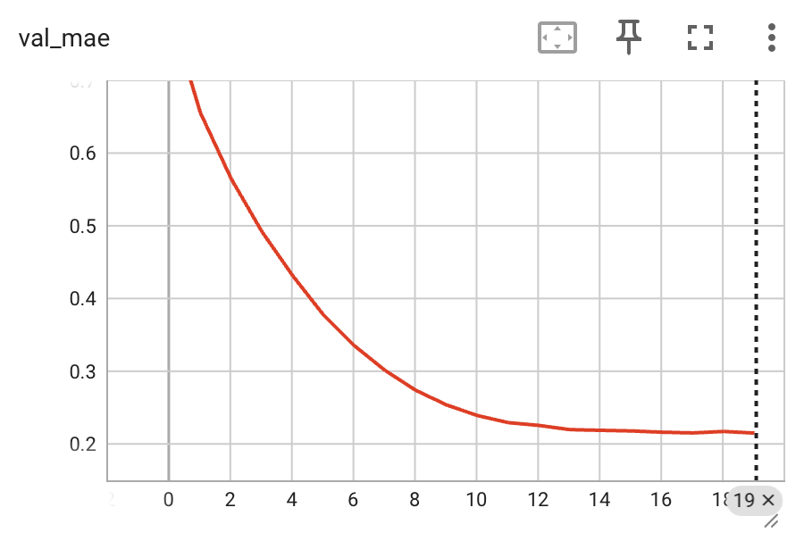

# Amazon Recommendation System

## Overview
This project predicts user-item scores for unseen items based on historical interactions (ratings)
and generates Top-K recommendations.

It uses matrix factorization with bias terms and embedding representations,
formulated as a regression task over explicit feedback.

**Pipeline**: Data Download - Preprocessing - Training - Evaluation - API (Inference)  
**Tech Stack**: Python, PyTorch, FastAPI, Pandas, Docker, TensorBoard

## Features
- Docker (GPU/CPU support)
- Data preprocessing with Pandas
- API with FastAPI
- Input validation using Pydantic
- API key protection via FastAPI Depends
- Configuration via Config class (paths, parameters)
- Logging for training and API monitoring
- Unit testing with PyTest
- CI pipeline via GitHub Actions (install, lint, tests)

## ML Approach
- Matrix factorization with user and item embeddings (with bias terms)
- Batch training via DataLoader (over **user-item-rating** triplets)
- Train/validation split
- Saving model to the file + JSON metadata storage
- Optimization via MSE loss
- Metrics: MSE, RMSE, MAE
- Manual learning rate scheduling based on epoch (currently disabled)
- TensorBoard logging

## Limitations
- Popular items have a greater score than the known user-item pairs due to global bias effects.
- Model outputs scores (not probabilities).
- Inference currently uses Pandas DataFrame, which might limit performance.
- The model uses classical matrix factorization. Currently, there are more modern recommendation models in the world (based on implicit feedback).
- Training performance is sensitive to batch size: reducing the batch size may increase epoch duration. This is likely caused by a data loading bottleneck (loading from Pandas in each iteration).

## Results
> **Epoch 20/20 | train_loss=0.0460 | val_loss=0.0854 | val_rmse=0.2922 | val_mae=0.2149**

### Metric Interpretation
The model is trained on normalized ratings in the [0, 1] range using the transformation (rating - 1) / 4.

- **MAE ≈ 0.21 (normalized)** corresponds to ≈ **0.84 rating points** on the original [1, 5] scale  
- **RMSE ≈ 0.29 (normalized)** corresponds to ≈ **1.16 rating points** on the original scale  

This means that, on average, predicted ratings deviate by less than 1 point from true user ratings.
- No significant overfitting is observed.
- The model converges within ~20 epochs


|  |  |
|----------------------------------------------|------------------------------------------|
|      |    |

## Logging
Basic logging is implemented to track training, inference, and system events. Logs include lifecycle events, request handling, and errors.

## Testing
Unit tests are implemented using PyTest to ensure correctness of core components.  
To run tests: ```pytest```
The current test file consists of 5 unit tests.

## CI/CD
Basic CI pipeline is implemented using GitHub Actions. The pipeline runs automatically on every push and pull request and includes:
- Dependency installation
- Code linting (Ruff)
- Running unit tests (PyTest)
This ensures that code style is consistent, core functionality is not broken, changes are validated before merging.

## Usage + Docker Setup
Two execution profiles are available:

**GPU (CUDA-enabled):**

``` docker compose --profile gpu up --build```

**CPU-only:**

``` docker compose --profile cpu up --build```

After starting the services:
- API documentation: http://localhost:8000/docs
- TensorBoard logs: http://localhost:6006/
1. Download dataset: ```/download``` (~876 MB)
2. Run preprocessing: ```/preprocess```
3. Train model: ```/train```
4. Run inference: ```/predict``` or ```/topk```.


## Dataset
The dataset contains explicit user-item ratings from Amazon reviews.

| item               | user                  | rating | timestamp      |
|--------------------|-----------------------|--------|----------------|
| B000K8PH8C         | A3PHJ4NMHMBBUB        | 5.0    | 1391212800     |
| B001T6BK6M         | A3DTVMQGMNLX26        | 2.0    | 1392854400     |
| B007GFX0PY         | A2ZGNB9CWL7SLK        | 1.0    | 1437091200     |

### Data Preprocessing
Implemented using Pandas:
1. Filter users and items with fewer than 5 interactions
2. Optional dataset subsampling via ```.sample()```
3. Encode users and items using ```.factorize()```
4. Save mappings (user - id, item - id, and reverse mappings for inference).
